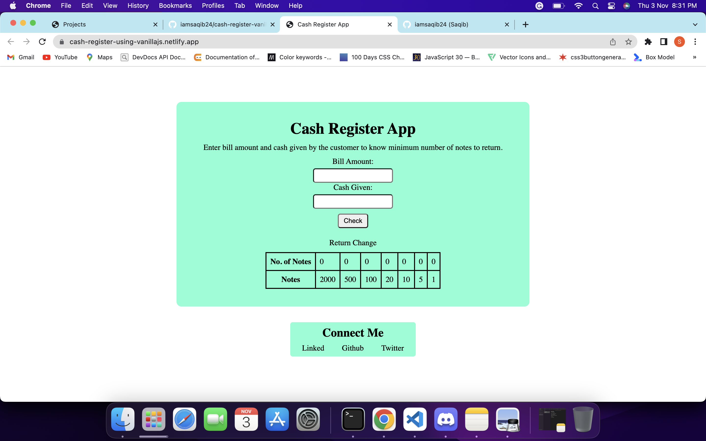

# Cash-Register-VanillaJS

This app has two input feilds, first ask user to enter bill amount and second ask for the cash amount which user gave. Then after calculation in behind the scene, it will tell how much money you need to retun with appropriate denominaton.

## Technologies i used to build this:

1. HTML
2. CSS
3. VanillaJS

---

## Project is live on server, to check [click here](https://cash-register-using-vanillajs.netlify.app/ "Cash Register")

## Image

